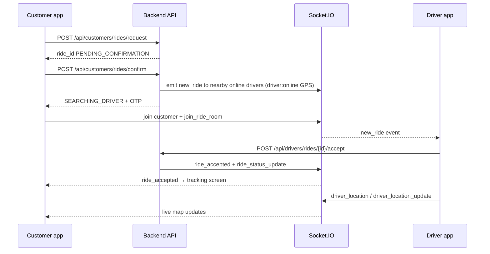

# Customer ↔ Driver ride integration

Both apps use **one backend** (`taxi-backend-main` on port **3000**) and **Socket.IO** on the same host.

| App | Path |
|-----|------|
| Customer | `D:\taxiuser\taxi_customer_app` |
| Driver | `D:\Taxi deiver\taxi-app` |
| Backend | `D:\Taxi Backend new\taxi-backend-main` |

## Configuration (must match)

**Customer** `.env.local`:

```env
API_BASE_URL=http://localhost:3000
```

**Driver** `lib/api/api_constants.dart` — `baseUrl` must be the **same host** (Chrome: `localhost:3000`, phone: your PC LAN IP).

## Run everything

```powershell
# Terminal 1 — backend
cd "D:\Taxi Backend new\taxi-backend-main"
npm run dev

# Terminal 2 — customer app
cd D:\taxiuser\taxi_customer_app
flutter run -d chrome

# Terminal 3 — driver app
cd "D:\Taxi deiver\taxi-app"
flutter run -d chrome
```

## End-to-end flow



### Customer steps (UI)

1. Login / Sign up  
2. Home → **Book New Ride**  
3. Pickup + drop → taxi type → **Continue** (`POST .../rides/request`)  
4. Booking summary → **Confirm ride** (`POST .../rides/confirm`)  
5. **Searching for driver** (socket + poll status)  
6. **Live tracking** when driver accepts  
7. **Invoice** when ride completes  

### Driver steps (UI)

1. Login as **verified** driver (`driver_verification_status: APPROVED`)  
2. **Drive** tab → **Go Online — Ride Requests** (socket `join` + `driver:online` with GPS every ~12s)  
3. Stay on **Ride Requests** before the customer taps **Confirm ride** — jobs arrive via `new_ride` (within ~25 km of pickup) or poll `GET /api/drivers/rides/incoming`  
4. **Accept** → `POST /api/drivers/rides/{rideId}/accept`  
5. **Active ride** — arrived → OTP → start → complete  

## API summary

| Step | Customer | Driver |
|------|----------|--------|
| Create quote | `POST /api/customers/rides/request` | — |
| Confirm / broadcast | `POST /api/customers/rides/confirm` | receives `new_ride` |
| List open rides | — | `GET /api/drivers/rides/incoming` |
| Accept | — | `POST /api/drivers/rides/{rideId}/accept` |
| Live status | `GET /api/customers/rides/{rideId}/status` | lifecycle POSTs |
| Cancel | `POST /api/customers/rides/{rideId}/cancel` | — |

## Socket events

| Event | Direction | Purpose |
|-------|-----------|---------|
| `join` | Client → server | `{ userId, role: customer \| driver }` |
| `join_ride_room` | Client → server | ride id string |
| `new_ride` | Server → drivers | After customer **confirm** |
| `ride_accepted` | Server → customer | After driver **accept** |
| `ride_status_update` | Server → customer | Status changes |
| `driver_location` / `driver_location_update` | Server → customer | Live GPS |

## Troubleshooting

| Problem | Fix |
|---------|-----|
| Driver never sees ride | Open **Ride Requests** first (sends `driver:online` with GPS). Driver must be within **~25 km** of pickup. Restart backend after updates. |
| Customer stuck on searching | Driver must **accept**; check logs for `new_ride emitted to nearby online drivers` |
| No live map | Customer on tracking screen; driver sending location updates |
| Customer access only on login | Email is driver account — use customer email or promote role in DB |
| Connection failed | Same `API_BASE_URL` / `baseUrl` on both apps; firewall port 3000 |

## Driver verification

Only **approved** drivers receive rides from `GET /incoming`. Socket `new_ride` is sent to **nearby online** drivers (`driver:online`); if none are online, it falls back to the whole `drivers` room.
