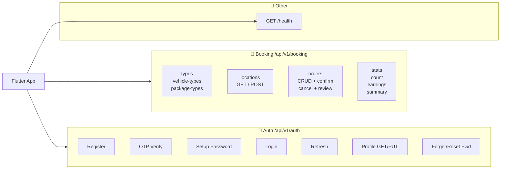
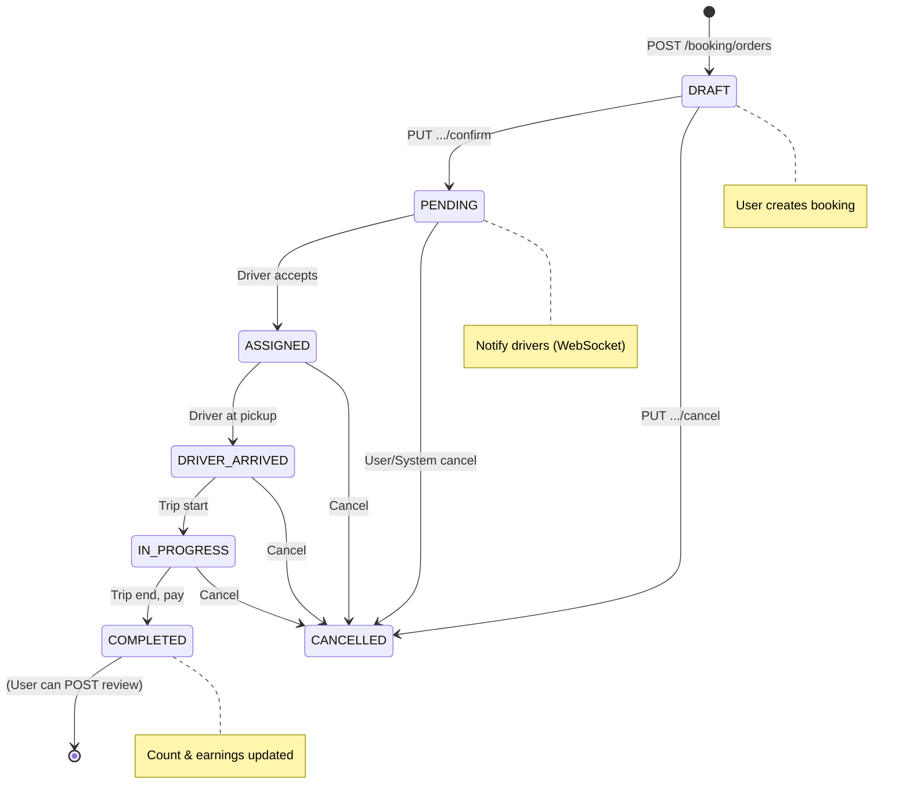
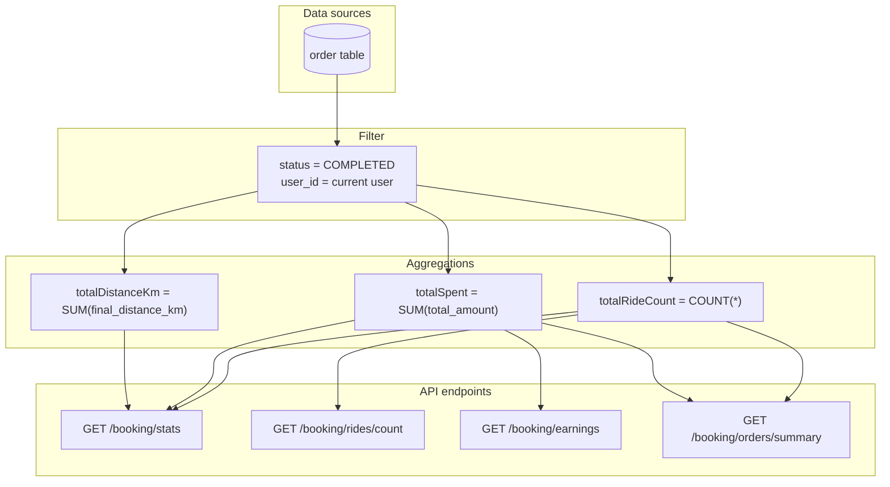
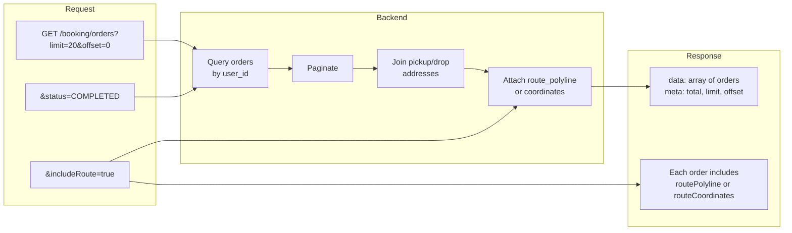
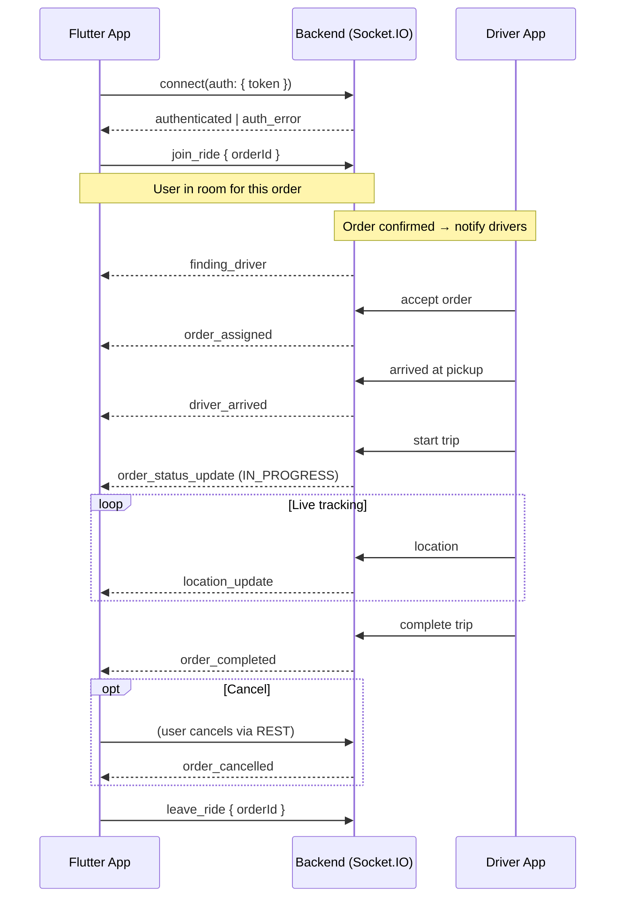
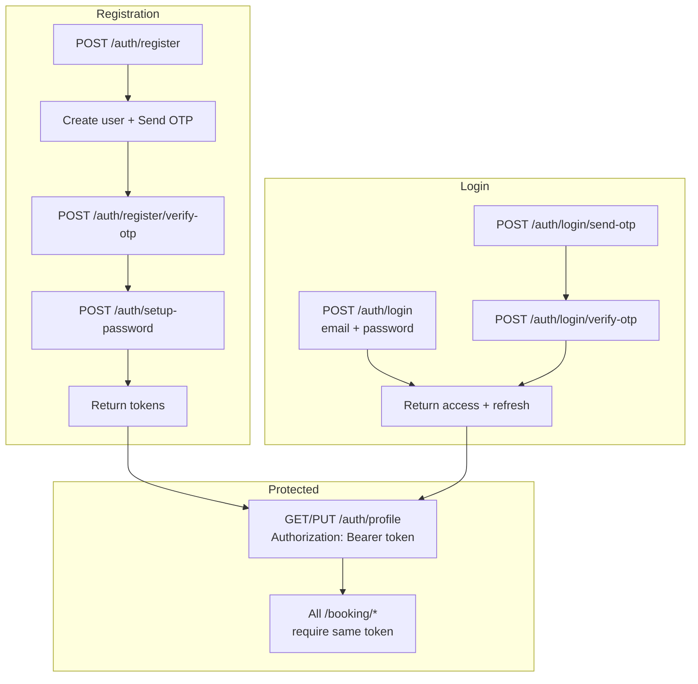
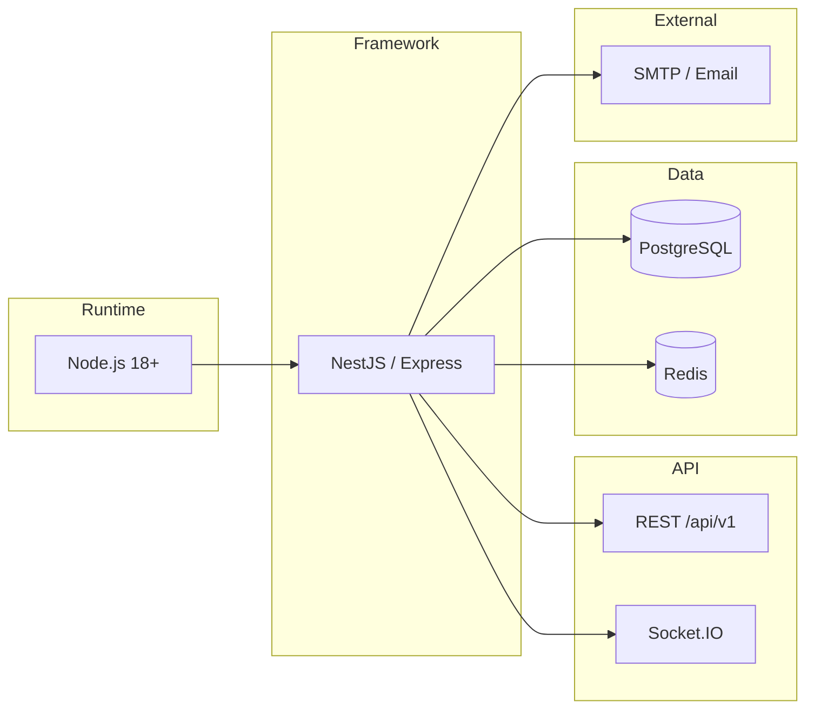
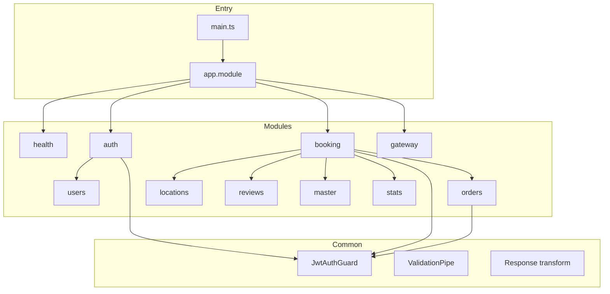

# Taxi Backend – Presentation Charts (Detailed)

Use these in slides, docs, or export to PDF. Mermaid diagrams render in GitHub, VS Code (Markdown Preview), and many presentation tools.

---

## 1. System Overview

```mermaid
flowchart TB
    subgraph Client["📱 Client (Flutter taxi_user)"]
        APP[Taxi User App]
    end

    subgraph Backend["🖥️ Backend (Node/NestJS)"]
        API[REST API<br/>/api/v1]
        WS[WebSocket<br/>Socket.IO]
        AUTH[Auth Module]
        BOOK[Booking Module]
        STATS[Stats Module]
        GW[Gateway]
    end

    subgraph Data["💾 Data & Services"]
        DB[(PostgreSQL)]
        REDIS[(Redis<br/>optional)]
        SMTP[Email / SMTP]
    end

    APP -->|HTTP + JWT| API
    APP -->|Token in handshake| WS
    API --> AUTH
    API --> BOOK
    API --> STATS
    WS --> GW
    AUTH --> DB
    BOOK --> DB
    STATS --> DB
    GW --> DB
    AUTH --> REDIS
    AUTH --> SMTP
```



---

## 2. High-Level API Map



---

## 3. Database Entity Relationship

```mermaid
erDiagram
    user ||--o{ refresh_token : has
    user ||--o{ user_location : has
    user ||--o{ order : "places (customer)"
    user ||--o{ order : "drives (driver)"
    user ||--o{ review : writes

    order }o--|| user_location : "pickup from"
    order }o--o| vehicle_type : "uses"
    order }o--o| package_type : "uses"
    order }o--o| booking_type : "type"
    order ||--o| review : "has one"

    user {
        int id PK
        string email UK
        string password_hash
        string name
        string phone
        string gender
        string role
        string street
        string city
        string pin_code
        bool email_verified
        timestamp created_at
        timestamp updated_at
    }

    refresh_token {
        int id PK
        int user_id FK
        string token
        timestamp expires_at
    }

    otp {
        int id PK
        string email
        string otp_code
        string purpose
        timestamp expires_at
        bool used
    }

    user_location {
        int id PK
        int user_id FK
        string label
        string address
        string street
        string city
        decimal lat
        decimal lng
        timestamp created_at
    }

    vehicle_type {
        int id PK
        string name
        string slug
        decimal base_fare
        decimal per_km
        decimal per_min
        bool is_active
    }

    package_type {
        int id PK
        string name
        string slug
        decimal max_kg
        bool is_active
    }

    booking_type {
        int id PK
        string name
        string slug
        bool is_active
    }

    order {
        int id PK
        int user_id FK
        int driver_id FK
        string status
        int pickup_location_id FK
        string pickup_address
        decimal pickup_lat
        decimal pickup_lng
        string drop_address
        decimal drop_lat
        decimal drop_lng
        string receiver_name
        string receiver_phone
        int booking_type_id FK
        int vehicle_type_id FK
        int package_type_id FK
        decimal weight_kg
        string payer_type
        string payment_mode
        decimal estimated_distance_km
        decimal final_distance_km
        decimal subtotal
        decimal tax
        decimal total_amount
        string cancel_reason
        timestamp confirmed_at
        timestamp assigned_at
        timestamp started_at
        timestamp completed_at
        text route_polyline
        timestamp created_at
    }

    review {
        int id PK
        int order_id FK UK
        int user_id FK
        int driver_id FK
        int rating
        string title
        text comment
        timestamp created_at
    }
```

---

## 4. Order Lifecycle (State Machine)



---

## 5. Stats, Count & Earnings Flow



**Response shapes:**

| Endpoint | Response (data) |
|----------|------------------|
| `/booking/stats` | `{ totalRideCount, totalSpent, totalDistanceKm, completedCount, cancelledCount }` |
| `/booking/rides/count` | `{ count }` |
| `/booking/earnings` | `{ totalSpent, currency }` |
| `/booking/orders/summary` | `{ totalRideCount, totalSpent }` (or same as stats) |

---

## 6. Order History & History with Route



**Single order with route:**  
`GET /booking/orders/:id?includeRoute=true` → one order with full route for map.

---

## 7. WebSocket Events (User App)



**Event summary:**

| Direction | Event | When |
|-----------|--------|------|
| Server → App | `authenticated` | Valid token |
| Server → App | `auth_error` | Invalid token |
| Server → App | `order_created` | Draft created |
| Server → App | `finding_driver` | Order confirmed |
| Server → App | `order_assigned` | Driver accepted |
| Server → App | `order_status_update` | Status changed |
| Server → App | `driver_arrived` | Driver at pickup |
| Server → App | `location_update` | Driver live location |
| Server → App | `order_cancelled` | Order cancelled |
| Server → App | `order_completed` | Trip completed |
| App → Server | `join_ride` | Subscribe to order |
| App → Server | `leave_ride` | Unsubscribe |

---

## 8. Auth Flow (Registration & Login)



---

## 9. Tech Stack (Overview)



| Layer | Choice | Purpose |
|-------|--------|---------|
| Runtime | Node.js 18+ | Backend runtime |
| Framework | NestJS or Express | REST + structure |
| API | REST + Socket.IO | HTTP + real-time |
| Database | PostgreSQL | Users, orders, locations, reviews |
| Cache | Redis (optional) | OTP, rate limit |
| Auth | JWT access + refresh | Stateless auth |
| Email | Nodemailer / SMTP | OTP delivery |

---

## 10. Module Dependency (Backend)



---

*Use this file in VS Code (Markdown Preview), GitHub, or any tool that supports Mermaid to view the charts. Export to PDF from browser or use in slide decks.*
